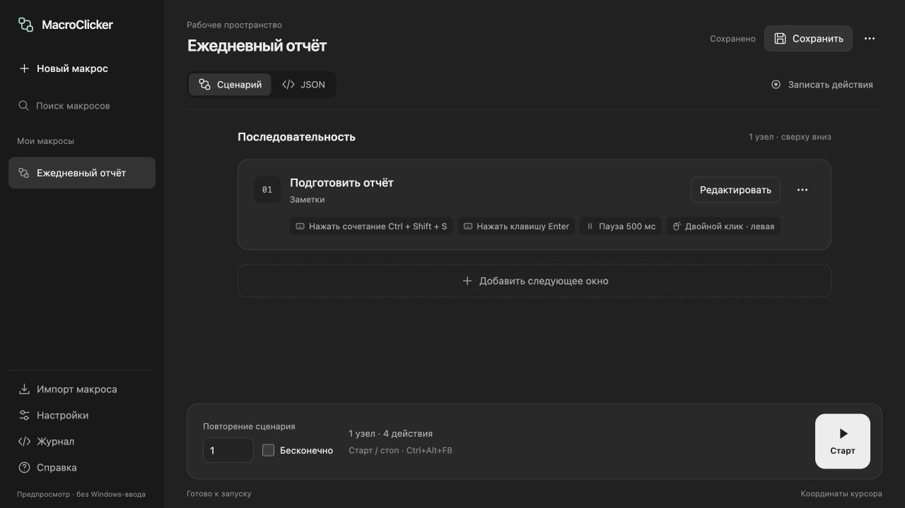
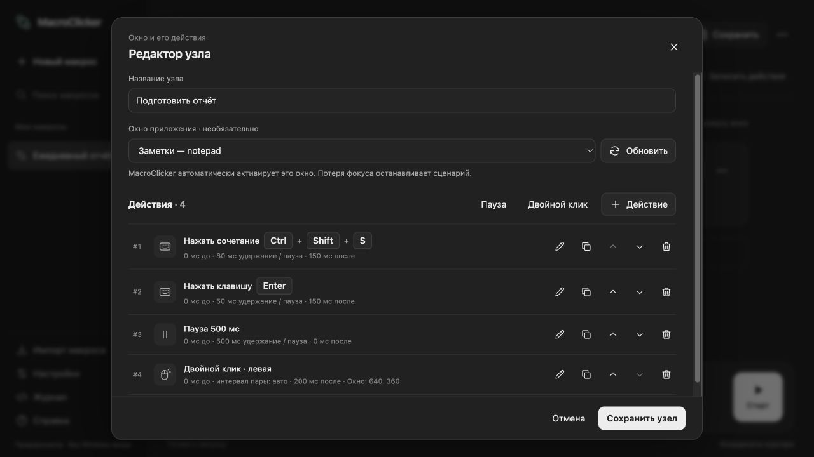
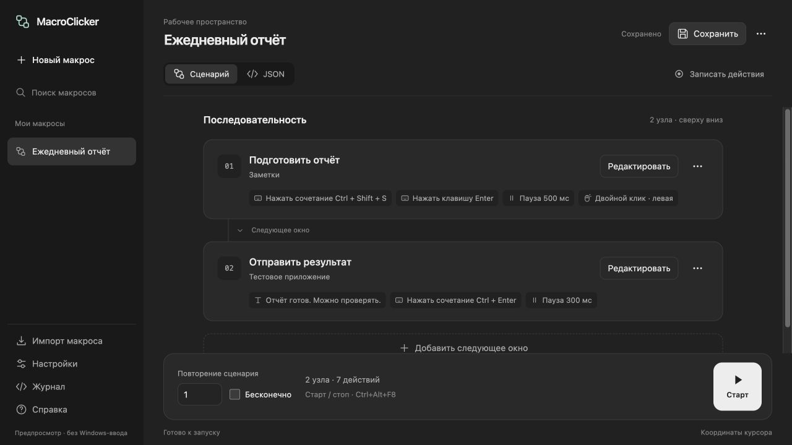

# MacroClicker

Макросы для Windows: собирайте действия в редакторе или записывайте их, сохраняйте сценарии и запускайте одной кнопкой.

**[Скачать последнюю версию](https://github.com/8GagariN8/MacroClicker/releases/latest)** · Windows x64 · Нужен WebView2 Runtime, отдельная установка .NET не требуется.



## Возможности

- **Клавиатура и текст:** отдельные клавиши, сочетания вроде `Ctrl+Shift+S`, захват комбинаций и длинный текст одним действием.
- **Мышь:** обычный и двойной клик, удержание, прокрутка и перемещение по координатам окна или экрана.
- **Дополнительные действия:** компактные карточки под основной нодой; выполнение раз в N повторений или по времени её работы, в том же или другом окне.
- **Переходы:** отдельная пауза перед следующей нодой с отображением времени на соединении.
- **Точные интервалы:** задержки до и после действия, время удержания, отдельные паузы и повтор сценария.
- **Несколько приложений:** узлы выполняются по порядку и переключают нужные окна. Выбор окна необязателен — для перехода вручную есть отсчёт 5 секунд.
- **Запись и библиотека:** запись действий выбранных приложений, сохранение и удаление макросов, корзина на 30 дней с восстановлением и очисткой, импорт и экспорт JSON.
- **Удобный редактор:** визуальный сценарий или JSON с подсветкой, светлая и тёмная темы, настраиваемые сочетания старта/остановки и журнал ошибок.

## Редактор узла

Клавиши показаны отдельными плашками: здесь `Ctrl+Shift+S` и `Enter`, пауза 500 мс и двойной клик по координатам. Номера шагов отделены от названий действий.



## Несколько окон в одном сценарии

Узлы выполняются сверху вниз: сначала подготовка отчёта в «Заметках», затем переход в другое приложение, ввод текста и `Ctrl+Enter`.



*Снимки актуального интерфейса в браузерном предпросмотре на Mac. Названия и сценарий демонстрационные; ввод Windows в предпросмотре не выполняется.*

> Макрос работает в активном окне, не в фоне. Потеря фокуса останавливает выполнение — параллельно управлять другими программами во время воспроизведения не следует.

[Как запустить](docs/user/START.md) · [Подробное руководство](docs/user/MANUAL.md) · [Сборка и релизы на GitHub](docs/development/RELEASING.md)

[Дополнительные ноды: настройка, порядок и примеры](docs/user/PERIODIC-ACTIONS.md).

## Структура проекта

```text
src/MacroClicker/   Приложение, интерфейс и ресурсы
tests/             Проверки движка и веб-интерфейса
docs/              Руководства, примеры и описания выпусков
scripts/           Сборка и упаковка
packaging/         Материалы для комплекта поставки
MacroClicker.sln    Решение для открытия в IDE
```

[Карта исходников и команды разработки](docs/development/REPOSITORY.md) · [Оглавление документации](docs/README.md).

Результаты сборки создаются в `artifacts/` и не хранятся в репозитории.
