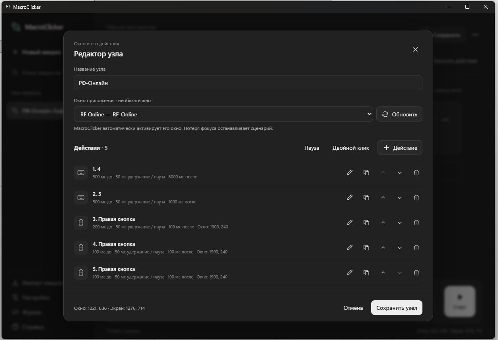

# MacroClicker

Макросы для Windows: собирайте действия в редакторе или записывайте их, сохраняйте сценарии и запускайте одной кнопкой.

**[Скачать последнюю версию](https://github.com/8GagariN8/MacroClicker/releases/latest)** · Windows x64 · Нужен WebView2 Runtime, отдельная установка .NET не требуется.

## Возможности

- **Клавиатура и текст:** отдельные клавиши, сочетания вроде `Ctrl+Shift+S`, захват комбинаций и длинный текст одним действием.
- **Мышь:** обычный и двойной клик, удержание, прокрутка и перемещение по координатам окна или экрана.
- **Точные интервалы:** задержки до и после действия, время удержания, отдельные паузы и повтор сценария.
- **Несколько приложений:** узлы выполняются по порядку и переключают нужные окна. Выбор окна необязателен — для перехода вручную есть отсчёт 5 секунд.
- **Запись и библиотека:** запись действий выбранных приложений, сохранённые макросы, импорт и экспорт JSON.
- **Удобный редактор:** визуальный сценарий или JSON с подсветкой, светлая и тёмная темы, настраиваемые сочетания старта/остановки и журнал ошибок.

## Интерфейс

Редактор узла: окно приложения, список действий, интервалы и координаты кликов.

Примеры сценариев:

- **Сочетание → пауза → клик:** `Ctrl+S` → 500 мс → двойной клик в заданной точке.
- **Переход между окнами:** приложение A → действия → приложение B → ввод текста.
- **Комбинация без ручного набора:** «Действие → Клавиши → Захватить сочетание» → нажать клавиши и отпустить.

> Макрос работает в активном окне, не в фоне. Потеря фокуса останавливает выполнение — параллельно управлять другими программами во время воспроизведения не следует.

[Как запустить](ЗАПУСК.md) · [Подробное руководство](docs/MANUAL.md)
